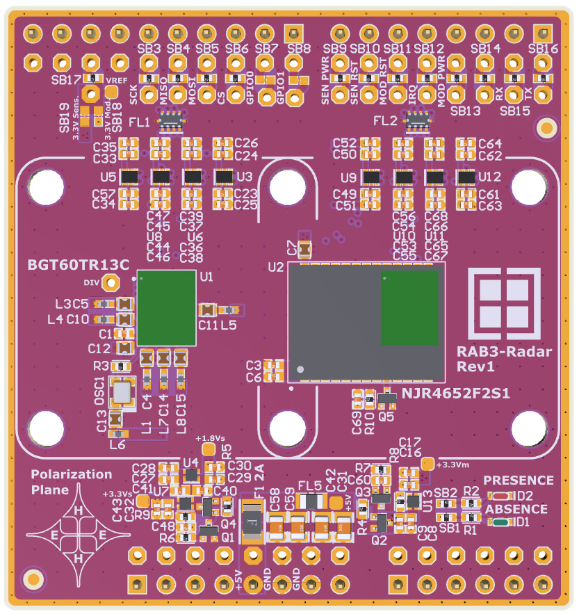

# RAB3-Radar Hardware Design Files

The RAB3-Radar is an evaluation board featuring the Infineon BGT60TR13CE6327XUMA1 and Nisshinbo NJR4652F2S1 60GHz Radars.

## Legal Disclaimer

The evaluation board including the software is for testing purposes only and, because it has limited functions and limited resilience, is not suitable for permanent use under real conditions. If the evaluation board is nevertheless used under real conditions, this is done at one’s responsibility; any liability of Rutronik is insofar excluded. 

